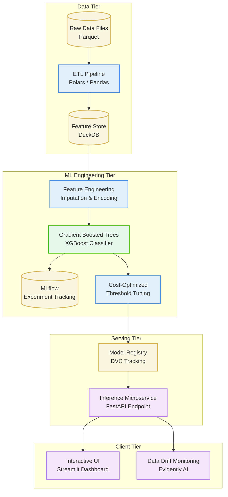
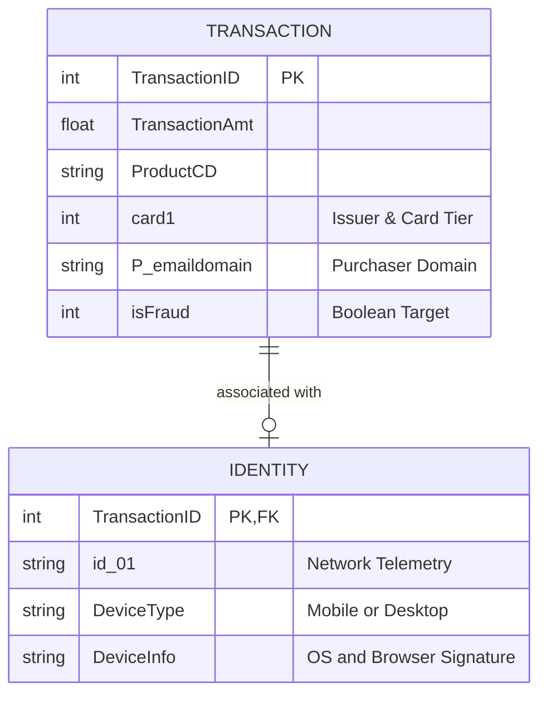

# 🛡️ Fraud Detection Pipeline: End-to-End MLOps Architecture

[](https://github.com/Ranvirsv/fraud-detection-pipeline/actions/workflows/ci.yaml)


An end-to-end Machine Learning pipeline designed to detect fraudulent e-commerce transactions. This project demonstrates production-grade MLOps practices, focusing on robust data engineering, extreme class imbalance handling, and a scalable serving architecture.

## 📖 Executive Summary

The fundamental challenge in transaction fraud detection is the extreme class imbalance (typically < 4% fraud rate in the IEEE-CIS dataset). Traditional machine learning approaches often fail in this domain because they optimize for overall accuracy rather than business outcomes.

This system is architected to address this challenge not just through algorithmic choice, but through systemic design:

- Engineering robust features from highly sparse identity and transaction data.
- Implementing a training pipeline that optimizes for imbalanced metrics and custom business cost functions (balancing the financial pain of missed fraud against the friction of false alarms).
- Enforcing a strict separation of concerns across data extraction, model training, and API serving.

## 🏗️ Technical Architecture

The architecture separates the pipeline into four distinct tiers: Data Ingestion, Model Engineering, Serving, and User Interface.



### Key Architectural Decisions

1. **Analytical Data Layer (DuckDB)**: Rather than processing large Parquet files completely in memory via Pandas, DuckDB acts as an embedded, in-process analytical datastore. This accelerates feature extraction (such as calculating rolling transaction windows and joining sparse identity tables).
2. **Robust Modelling over Deep Learning**: Due to the tabular nature of the data and its inherent sparsity (especially in identity metadata), tree-based ensembles (XGBoost) are favored over neural networks. They inherently handle missing values without aggressive imputation and model non-linear boundaries efficiently.
3. **Threshold Tuning vs. Default Cutoffs**: The system rejects the default `0.5` probability threshold. Instead, the final decision boundary is drawn via dynamic threshold tuning against a defined cost matrix (e.g., Cost of False Positive = $10; Cost of False Negative = $500).
4. **Decoupled Serving**: The prediction logic is abstracted behind a stateless FastAPI microservice. The Streamlit application and Evidently AI monitors only ever interact with the model via HTTP, mimicking a real microservice topology.

## 🗄️ Data Entity Relationships

The data model relies on a one-to-optional joining of transactional events with device/identity telemetry.



_Note: A critical insight driving the feature engineering is that fraudulent transactions possess entirely different missing-data patterns in the `IDENTITY` table compared to legitimate transactions._

## 📁 System Modules

```text
Fraud_Detection_Pipeline/
├── app/                  # Client Tier: Streamlit dashboard for interactive exploration
├── src/
│   ├── api/              # Serving Tier: FastAPI schemas, routes, and model loaders
│   ├── etl/              # Data Tier: Ingestion scripts building the DuckDB warehouse
│   ├── features/         # ML Tier: Transformers mapping raw schema to feature matrix
│   ├── models/           # ML Tier: XGBoost training and cross-validation pipelines
│   └── monitoring/       # Client Tier: Evidently AI reporters for target & covariate drift
├── tests/                # Comprehensive test suites verifying pipeline integrity
├── .github/workflows/    # CI pipelines enforcing format, linting, and tests on push
├── pyproject.toml        # Unified dependency and build specification via uv
└── Makefile              # Task runner for standardized execution
```

## 🛠️ Reproducing the Pipeline

This repository is designed to be easily reproducible for technical review. The project uses `uv` for deterministic, ultra-fast Python environment management.

```bash
# 1. Clone the repository
git clone https://github.com/yourusername/Fraud_Detection_Pipeline.git
cd Fraud_Detection_Pipeline

# 2. Setup the environment with uv
make install

# 3. Verify System Integrity
# Runs the full test suite encompassing data shapes, model outputs, and API mocks.
make test
```

_Note: Once end-to-end execution scripts are finalized, you will be able to run the full training pipeline and spin up the API+UI with independent `make` commands._
